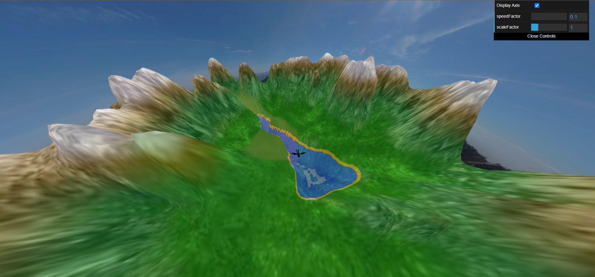
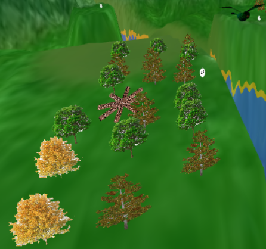

# CG 2022/2023

## Group T05G07

### Members

| Name                                         | Number      |
| -------------------------------------------- | ----------- |
| Ana Carolina Araujo Marques de Brito Brandão | `202004461` |
| Guilherme Valler Moreira                     | `202007036` |

## Project

### Observations

Regrding the additional development, we chose to drop the egg in a parabolic trajectory.

### Screenshots

| { width="800" height="600" style="display: block; margin: 0 auto" } |
| :------------------------------------------------------------------------------------------------------------------: |
|                                       **Fig. 1:** Screenshot of panorama image                                       |

| { width="800" height="600" style="display: block; margin: 0 auto" } |
| :------------------------------------------------------------------------------------------------------------------: |
|                                            **Fig. 2:** Screenshot of bird                                            |

| { width="800" height="600" style="display: block; margin: 0 auto" } |
| :------------------------------------------------------------------------------------------------------------------: |
|                                          **Fig. 3:** Screenshot of terrain                                           |

| { width="800" height="600" style="display: block; margin: 0 auto" } |
| :------------------------------------------------------------------------------------------------------------------: |
|                                  **Fig. 4:** Screenshot of bird with eggs and nest                                   |

| { width="800" height="600" style="display: block; margin: 0 auto" } { width="800" height="600" style="display: block; margin: 0 auto" } |
| :--------------------------------------------------------------------------------------------------------------------: |
| **Fig. 5a, 5b:** Screenshot of trees |

Links das texturas das arvores:

- https://www.designi.com.br/90c6452b67a92851
- https://www.imagensempng.com.br/arvore-png-2/
