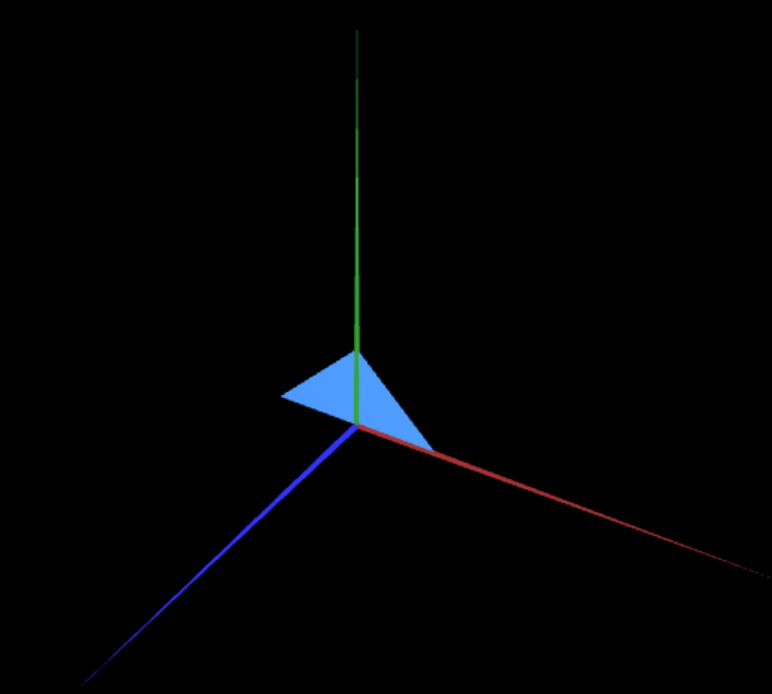
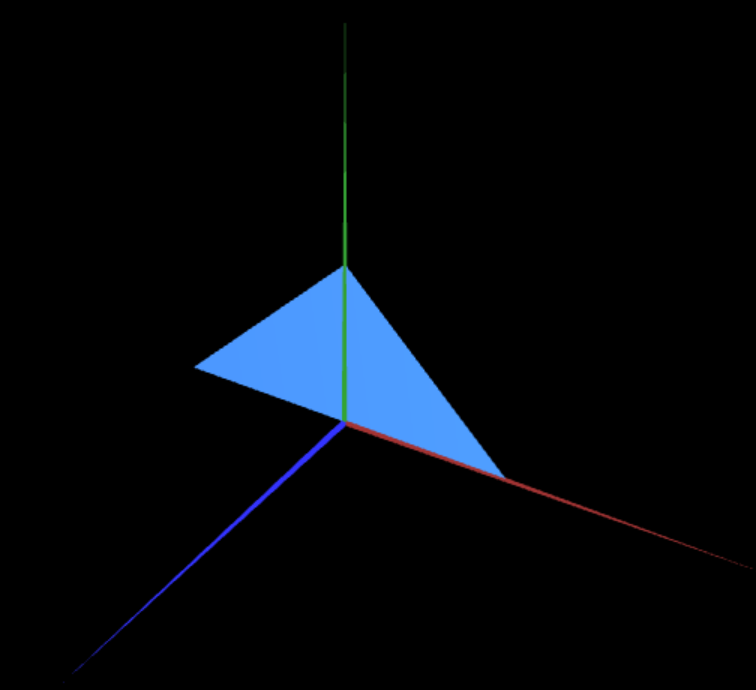
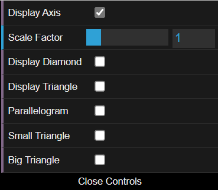

# CG 2022/2023

## Group T05G07

## TP 1 Notes

- In exercise 1 we observed that we can easily toggle between the two visibility options (visible and invisible) by using the small menu in the top right corner of the window, after creating it in the "MyInterface.js" file.
- In exercise 2 we decided to take a differente approach by passing the size of the triangle created as a parameter, instead of just creating two seperate triangles with different sizes. At first we struggled to find a way to pass the size as a parameter, but after some research we found out how to do it. We also added a checkbox to toggle between the two visibility options for both the triangles (size 1 and 2).

