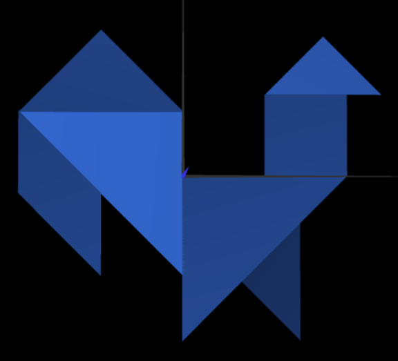
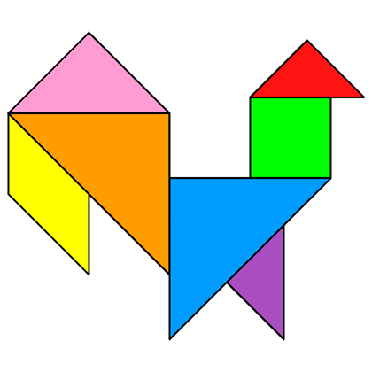
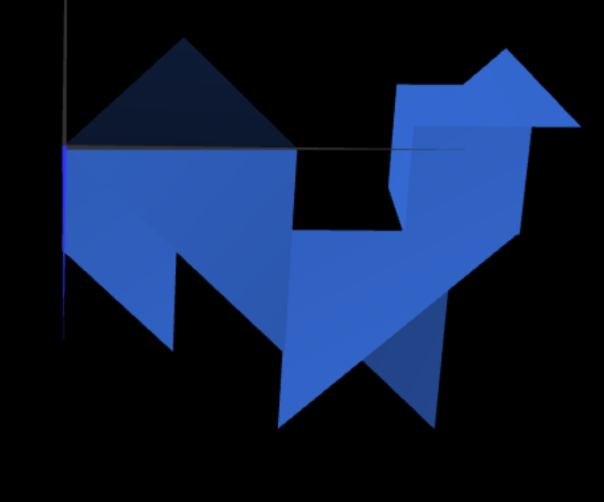
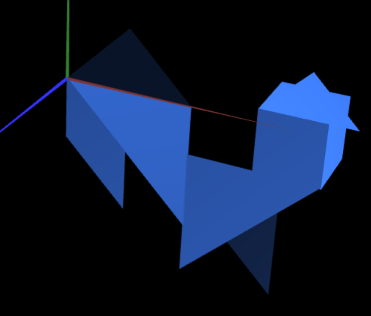
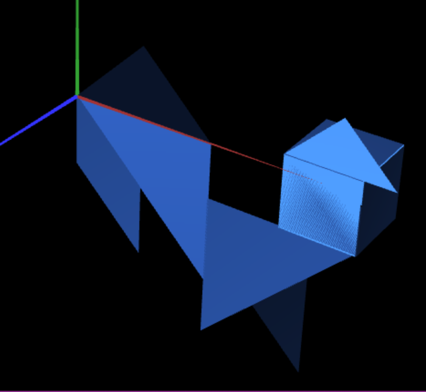
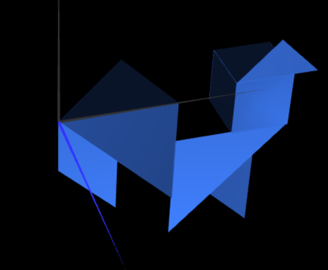

# CG 2022/2023

## Group T05G07

## TP 2 Notes

- In exercise 1 we observed that we can instantiate the objets of the primitive classes developed in previous class. We had some dificulties in making transformations of the objects, because the values we input on them didn't match the respective transformation we imagined, so we needed to try and error.

- In exercise 2 we had some dificulties in making the transformations of the objects, because the values we input on them didn't match the respective transformation we imagined, so we needed to use trial and error.

- In exercise 3 it was pretty straight forward, we just had to make the transformations of the objects and then make the respective transformations of the camera. I'd say we had a little bit of a hard time with the rotation angles, but we figured it out quickly.

