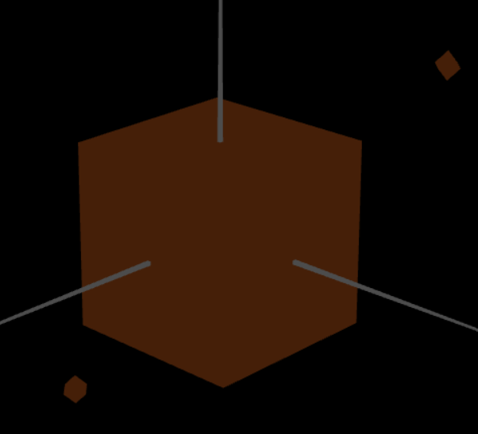
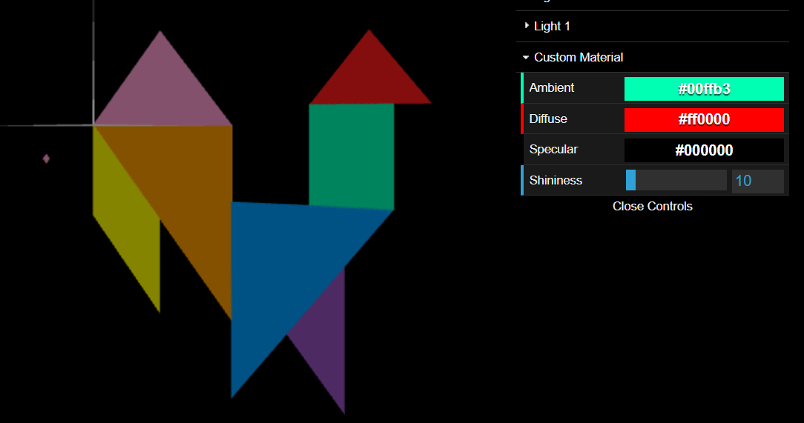
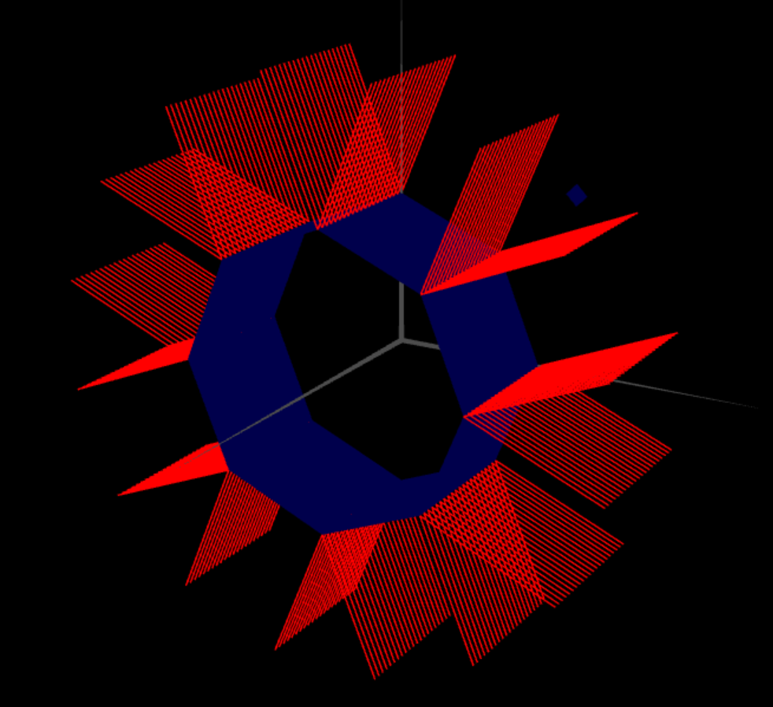
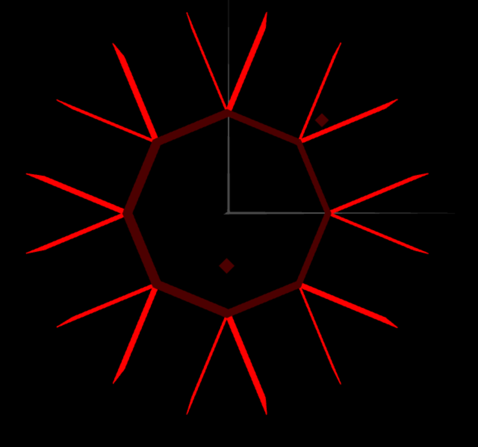
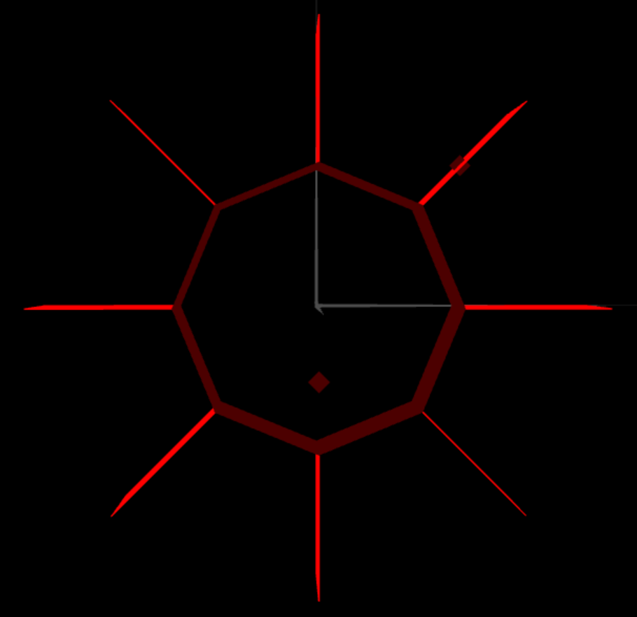
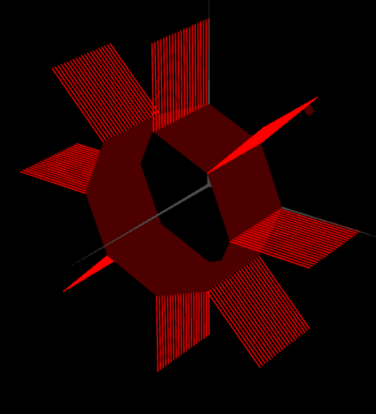

# CG 2022/2023

## Group T05G07

## TP 3 Notes

- In exercise 4 we started to use colors as we don´t understand the rgb we used the function hexToRgbA().

- In exercise 6 it was pretty straight forward as we simply removed the line where we added the color of the diamond.

- We initially had some trouble doing the shapes in a way where we could change the number of sides and stacks, but eventually we found a way around it.

- For part 3 we found it pretty straight forward, we just had to remove the for loop where we doubled the amount of vertices created. For the normals we just did some simple math and got to the intended result. Overall it was easier than part 2.

