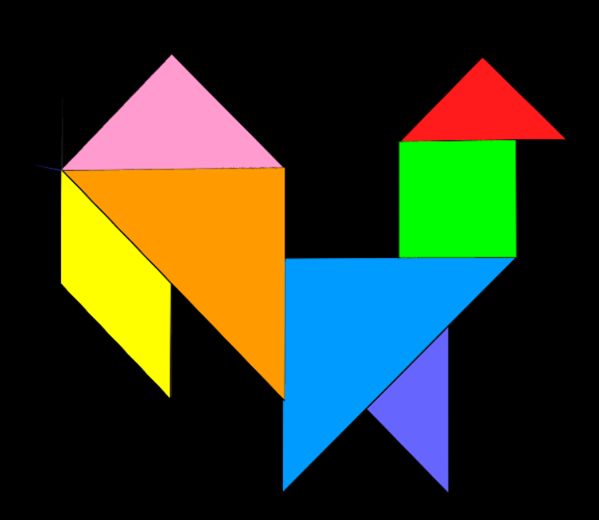
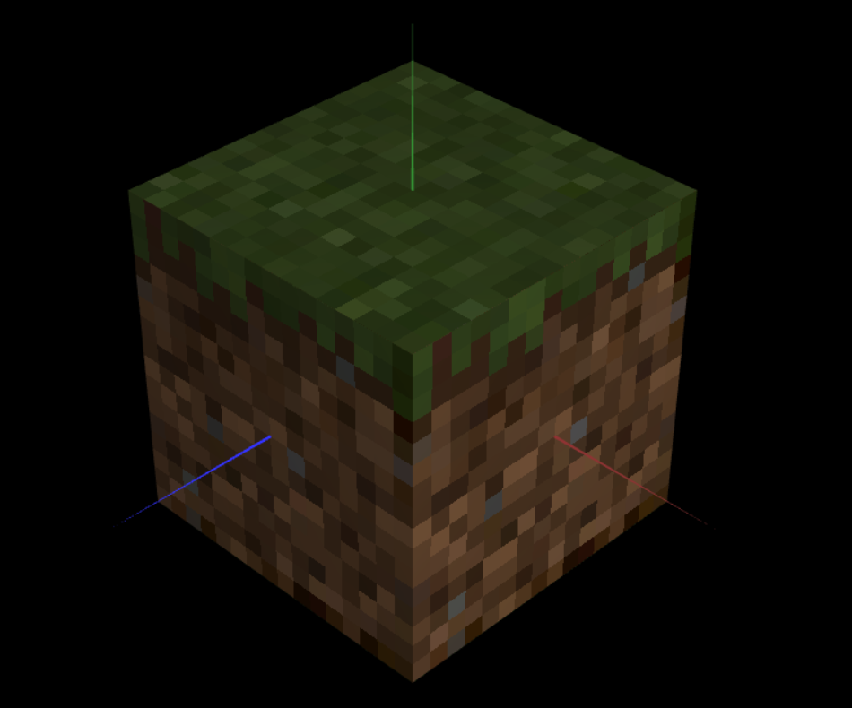

# CG 2022/2023

## Group T05G07

## TP 4 Notes

- In the tangram picture provided by the teacher, there was no purple color available, but instead 2 shades of blue, so we decided to use one of those shades instead of purple.

- We applied the mencioned commented line of the code in each of the faces of the cube that applied a 
linear filtering on the texture

