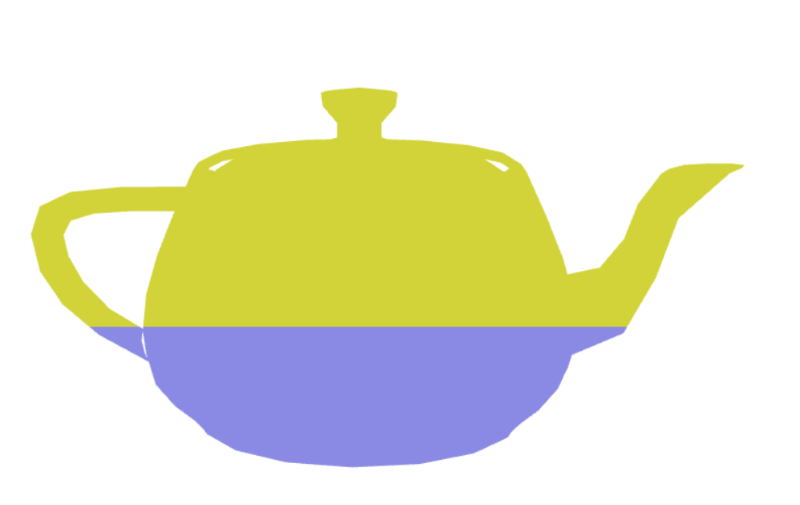
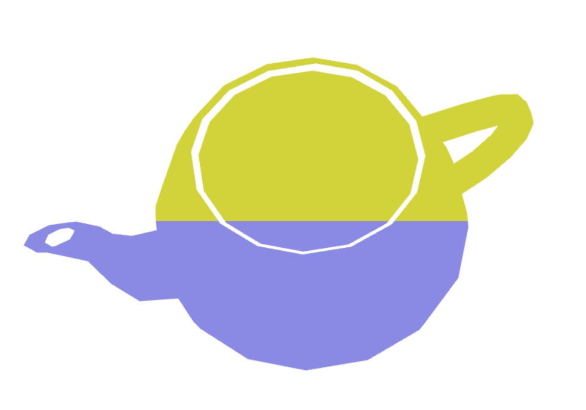
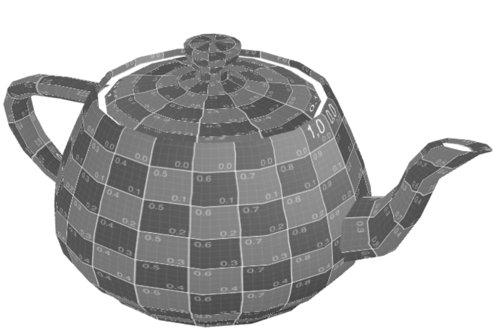
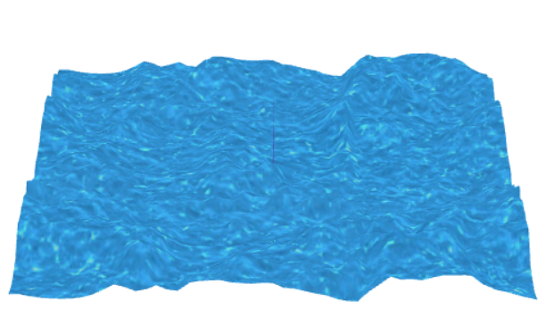

# CG 2022/2023

## Group T05G07

## TP 5 Notes

-  In exercise 1.1 we copied the files flat.vert and flat.frag and created the files Ex1.vert and Ex1.frag

- In exercise 1.3 we copy the file sepia.frag and created the file sepia2.frag changing as requested

-In exercise 2

